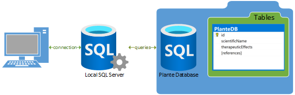
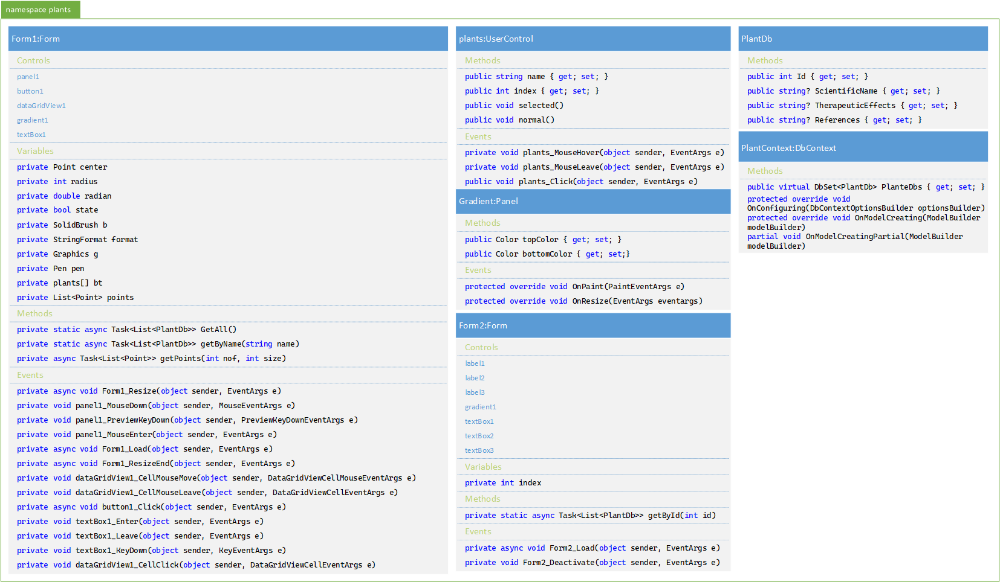
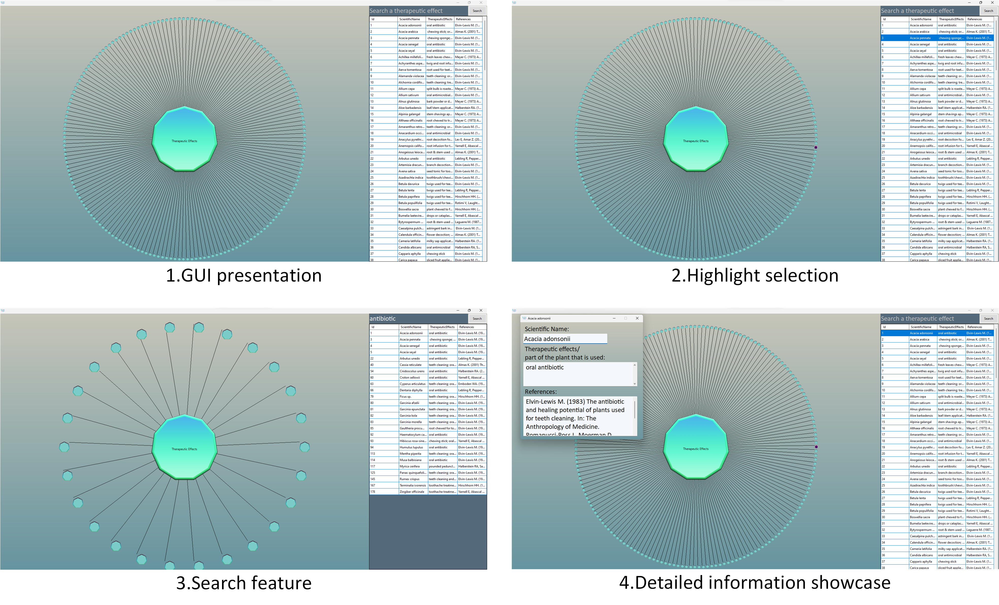

# PlantsDB
A C# .NET application built as a search engine with a interactive GUI for a database with plants used in alternative treatment of oro-dental pathologies.
## Instructions
### Building the project
Building it in [Visual Studio](https://visualstudio.microsoft.com/), the following NuGet packeges are required:
* [Control.Dragabble](https://github.com/intrueder/Control.Draggable)
* [Microsoft.EntityFrameworkCore](https://learn.microsoft.com/en-us/ef/core/)
* [Microsoft.EntityFrameworkCore.SqlServer](https://learn.microsoft.com/en-us/ef/core/)
* [Microsoft.EntityFrameworkCore.Tools](https://learn.microsoft.com/en-us/ef/core/)
### SQLServer connection
The following method is used for configuring the server connection:
```C#
protected override void OnConfiguring(DbContextOptionsBuilder optionsBuilder)
```
found in [PlantContext.cs](https://github.com/BorcaAlexandruMiron/PlantsDB/blob/master/Plants/Models/PlantContext.cs). The connection string describes the server link (that can be configurated for a non-local database), the database that we want to access (that is provided in [Resources/Plante.mdf](https://github.com/BorcaAlexandruMiron/PlantsDB/blob/master/Plants/Resources/Plante.mdf)) and the creditentials (in our case being trusted with WindowsAuth). The next diagram provides a visual representation of our MSSQLLocalDB connection and database interrogation:


## Implementation and GUI showcase
### Class diagram

### GUI 
Using the provided database [Resources/Plante.mdf](https://github.com/BorcaAlexandruMiron/PlantsDB/blob/master/Plants/Resources/Plante.mdf), the following image showcases the project GUI (graphical user interface) and the interactive and search features:

